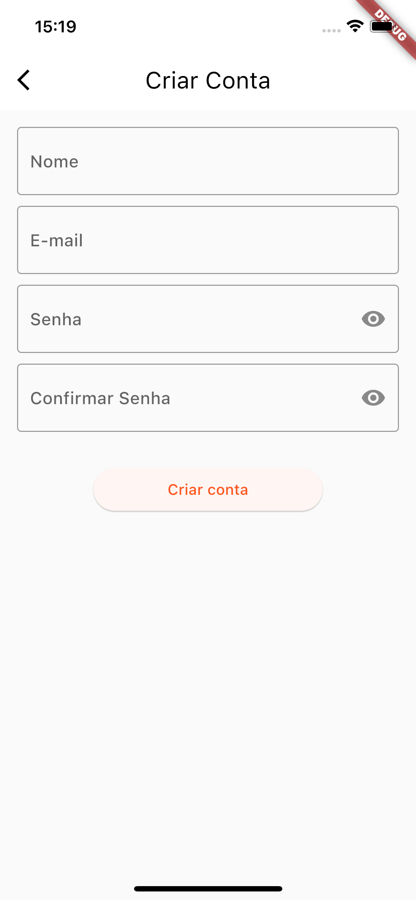
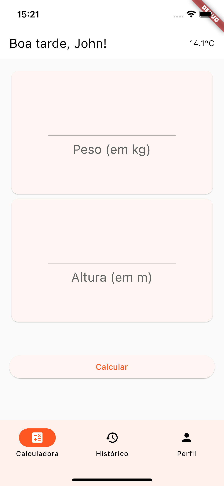
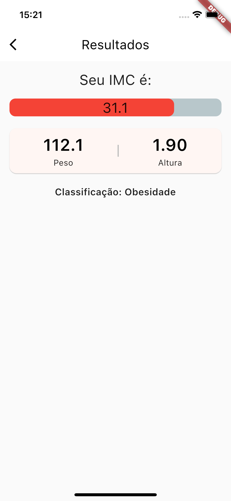
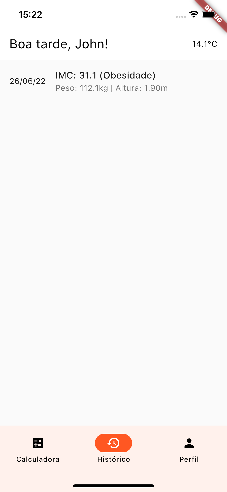
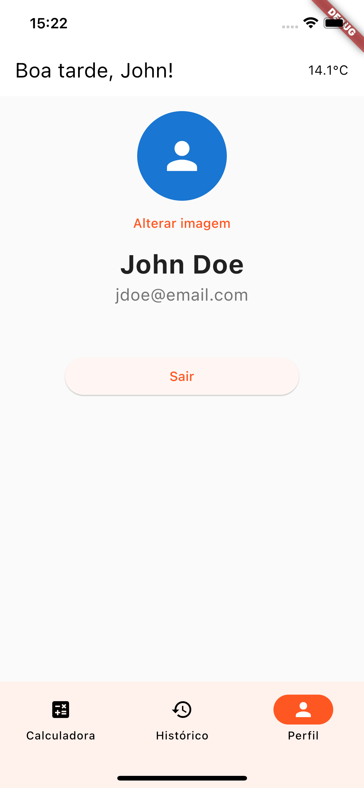

# Calculadora IMC

Este projeto é o projeto de conclusão das disciplinas de Flutter do curso MIT em Desenvolvimento Mobile, oferecido pela instituição INFNET.

A aplicação consiste em uma calculadora de IMC (Índice de Massa Corporal) e conta com funcionalidades como registro de histórico de cálculos e perfil individual para o usuário com foto.

Apesar de ter sido utilizada a ferramenta _crossplatform_ Flutter, esta aplicação foi desenvolvida para as plataformas **Android** e **iOS** apenas.

|       |  |  |                                                    |
| ----------------------------------------------------- | -------------------------------------------------- | --------------------------------------------------------- | -------------------------------------------------- |
|  |  |         |  |

## Dependências

Este projeto faz uso dos seguintes pacotes:

- [cached_network_image](https://pub.dev/packages/cached_network_image)
- [dio](https://pub.dev/packages/dio)
- [flutter_modular](https://pub.dev/packages/flutter_modular)
- [firebase_core](https://pub.dev/packages/firebase_core)
- [firebase_auth](https://pub.dev/packages/firebase_auth)
- [firebase_storage](https://pub.dev/packages/firebase_storage)
- [geolocator](https://pub.dev/packages/geolocator)
- [image_picker](https://pub.dev/packages/image_picker)
- [intl](https://pub.dev/packages/intl)
- [loader_overlay](https://pub.dev/packages/loader_overlay)
- [percent_indicator](https://pub.dev/packages/percent_indicator)
- [shared_preferences](https://pub.dev/packages/shared_preferences)
- [validatorless](https://pub.dev/packages/validatorless)

Adicionalmente, existe um pacote desenvolvido pelo autor deste projeto que também é utilizado:

- [password_validators](https://github.com/bmsrangel/flutter_password_validators)

## Dependências de Desenvolvimento

- [faker](https://pub.dev/packages/faker)
- [firebase_auth_mocks](https://pub.dev/packages/firebase_auth_mocks)
- [firebase_storage_mocks](https://pub.dev/packages/firebase_storage_mocks)
- [mocktail](https://pub.dev/packages/mocktail)
- [modular_test](https://pub.dev/packages/modular_test)

## Execução do Projeto

### Pré-requisitos gerais

A execução deste projeto possui os seguintes requisitos:

- Um desktop ou laptop com Windows 10 ou posterior, Linux (64-bit), macOS ou Chrome OS;
  - Maiores informações sobre os requisitos podem ser encontrados na página de instalação do Flutter (link abaixo);
- [Flutter](https://docs.flutter.dev/get-started/install)
  - Versão mínima: 2.5;
    - Para verificar a versão do Flutter instalada e status da instalação dos seus componentes, basta executar no terminal o comando `flutter doctor -v`;
- [Android Studio](https://developer.android.com/studio);
  - Depois de instalado, é necessário acrescentar os plugins do Dart e do Flutter;
- [Visual Studio Code](https://code.visualstudio.com) (Opcional);
  - Depois de instalado, é necessário acrescentar as extensões do Dart e do Flutter;

### Pré-requisitos específicos

Para executar esta aplicação em iPhones ou no Simulator, é necessário um dispositivo que utilize o macOS como sistema operacional, tais como MacBooks e iMacs. Adicionalmente, o dispositivo necessita ter o Xcode instalado e atualizado.

### Clonando o repositório

O primeiro passo é clonar o repositório. Isto pode ser feito através do download do arquivo .zip ou executando o seguinte comando no terminal na pasta onde deseja-se que o projeto seja armazenado:

```bash
git clone https://github.com/bmsrangel/imc_calculator.git
```

> Atenção! Para clonar o repositório via linha de comando, é necessário que o dispositivo possua o _git CLI_ instalado.

### Baixando as dependências

Depois de clonado o repositório, é necessário acessar a pasta do projeto e efetuar o download das dependências. Isto pode ser efetuado de maneiras diferentes, conforme a ferramenta de edição em uso. Mas, a forma mais simples é pelo terminal.
Na raíz do projeto, basta executar o comando:

```bash
flutter pub get
```

### Executando o projeto

Depois de baixadas as dependências, basta iniciar uma instância do Android Emulator ou do Simulator (específico para macOS), ou conectar um dispositivo Android ou iOS (específico para macOS) fisicamente à estação de trabalho e executar o comando:

```bash
flutter run
```

Note que este comando iniciará a aplicação em modo de depuração e poderá não refletir adequadamente o desempenho desta.
Para verificação de performance, recomenda-se utilizar somente dispositivos físicos e executar o comando:

```bash
flutter run --profile
```

## Reportando erros e bugs

Caso algum problema seja notado, este pode ser reportado a partir da abertura de _issues_ no repositório.
Ou, caso o desenvolvedor saiba efetuar a correção, pode efetuar um _fork_ do repositório, corrigir o erro e submeter um _pull request_. Caso a correção seja aprovada, esta será incorporada à aplicação.
